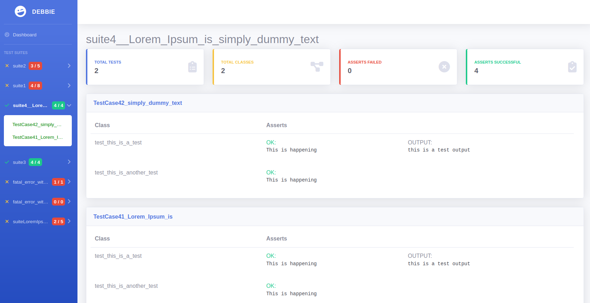

# Debbie

The minimal PHP test library with beautiful test reports.


# Try Debbie's own tests

## Run all suites

```shell
$ php cli.php tests
```

## Run one suite

```shell
$ php cli.php tests suite1
$ php cli.php tests suite2
```

# Integrate Debbie into your project

## Add composer dependency

```json
{
  ...
  "repositories": [
    {
      "type": "vcs",
      "url": "https://github.com/CaboLabs/Debbie"
    }
    ...
    ...
  "require": {
    "php": "^7.0|^8.0",
    "cabolabs/debbie": "^0.8",
    ...
    ...
  }
}
```

## Create script to run the tests

```php
// test.php

<?php

// Create the test run environment
$run = new \CaboLabs\Debbie\DebbieRun();

// Init with the folder that has all the test suites
$test_suite_root = './mytests';
$run->init($test_suite_root);

// Run all test cases from all test suites
$run->run_all();

// Render the test report in HTML
$report_path = './report.html';
$run->render_reports_html($report_path);
```

## Create a suite and test case

```php
// mytests/suite1/testcase.php

<?php

namespace mytests\suite1;

use \CaboLabs\Debbie\DebbieTestCase;

class TestCase1 extends DebbieTestCase {

   public function test_this_is_a_test()
   {
      echo "this is a test output";
      $this->assert(true, "This message only appears when the assert evaluates to false");
   }

   public function test_this_is_another_test()
   {
      // add extra parameters to show on the test report
      $debug_parameters = ['var1' => 'val1'];
      $this->assert(false, "This is a fail", $debug_parameters);
   }

   public function test_no_output()
   {
      $this->assert('cabolabs' == strtolower('CaboLabs'));
   }
}

```

## Run your tests

```shell
$ php test.php
```

## Open your test report in a browser and enjoy!

```shell
$ firefox report.html
```

